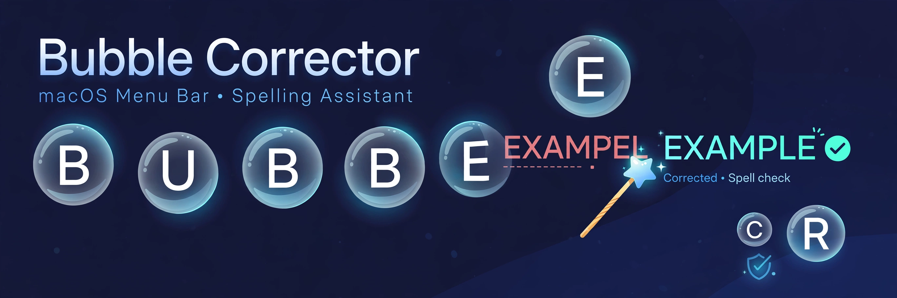
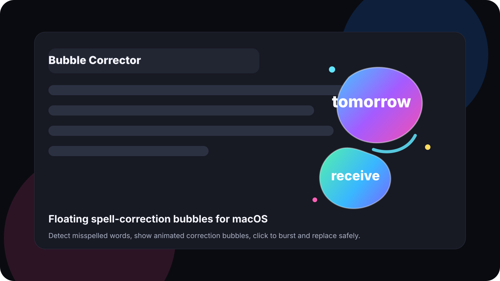
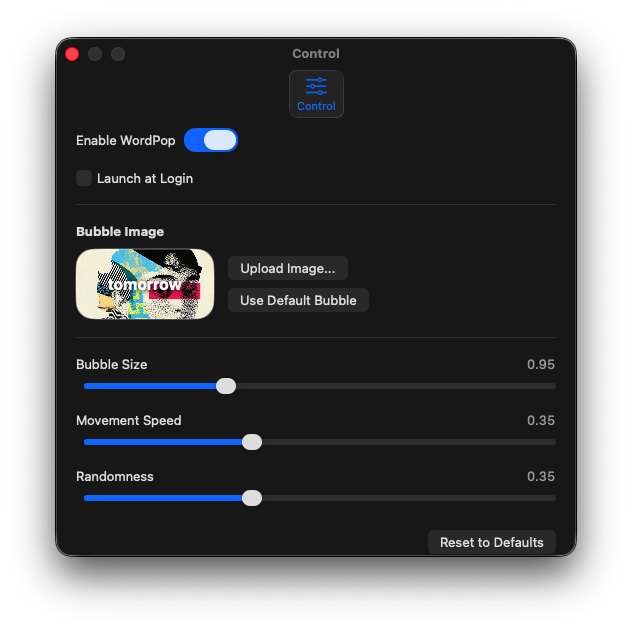

# Bubble Corrector

> ## Status: 🟢 Completed
>
> <progress value="95" max="100"></progress>
>
> **Progress: 95%** — Fully working macOS menu bar app with built DMG. Only polish items remain.

<p align="center">
  
</p>


## What it is

Bubble Corrector (built as **WordPop**) is a native macOS menu bar app that watches your typing system-wide. When it detects a misspelled word, it spawns a floating, animated correction bubble on your screen — click the bubble and it bursts, then WordPop safely replaces the misspelled word. It's a lightweight utility with no Dock icon, built entirely on native macOS APIs.

[Download the DMG](https://github.com/Geltrax69/Bubble_Corrector/raw/main/dist/WordPop.dmg)

## What works (verified)

- ✅ **System-wide spelling detection** — `SpellCheckerService` uses native macOS spell checking
- ✅ **Floating animated bubbles** — `BubbleManager` handles multiple simultaneous bubbles with collision physics
- ✅ **Click-to-burst correction** — `ReplacementEngine` safely replaces the original word
- ✅ **Keyboard monitoring** — `KeyboardMonitorService` + `WordBufferService` track typing via Accessibility APIs
- ✅ **Customization** — bubble shapes (Bubble, Circle, Rounded, Diamond, Star, Random Curves), custom image/GIF backgrounds, speed controls
- ✅ **Built artifact** — `dist/WordPop.dmg` is ready to download and install
- ✅ **Live preview** — control panel shows real-time bubble preview

## Tech stack

| Layer | Technology |
|-------|-----------|
| Language | Swift 5.9 |
| Platform | macOS 14+ |
| UI | SwiftUI + AppKit |
| APIs | Accessibility, NSSpellChecker |
| Build | Swift Package Manager |

## How to run

**Option 1 — Install the DMG (easiest):**
Download [WordPop.dmg](https://github.com/Geltrax69/Bubble_Corrector/raw/main/dist/WordPop.dmg), open it, and drag to Applications. Grant Accessibility permissions when prompted.

**Option 2 — Build from source:**
```bash
swift build -c release
```

> Note: Requires macOS 14+ with Xcode. The app needs Accessibility permissions to monitor typing system-wide.

## Screenshots

<p align="center">
  
  
</p>

## What you can add more

- [ ] **Custom dictionaries** — let users add their own words/names to skip
- [ ] **Multi-language support** — spell checking in languages beyond system default
- [ ] **Bubble themes** — preset packs (neon, pastel, minimal)
- [ ] **Statistics dashboard** — track corrections per day/week
- [ ] **Auto-update** — Sparkle framework for in-app updates
- [ ] **Keyboard shortcut** — trigger manual spell check on selected text

## Project structure

```
Bubble_Corrector/
├── WordPop/
│   ├── App/              # App entry point, menu bar setup
│   ├── Managers/         # BubbleManager, AccessibilityManager
│   ├── Models/           # BubbleSettings and data models
│   ├── Services/         # SpellChecker, KeyboardMonitor, ReplacementEngine, WordBuffer
│   └── Utilities/        # Logging
├── Scripts/              # Build scripts
├── dist/                 # Built DMG
└── docs/                 # Images and documentation
```

---
*README written after code audit on 2026-10-08.*
